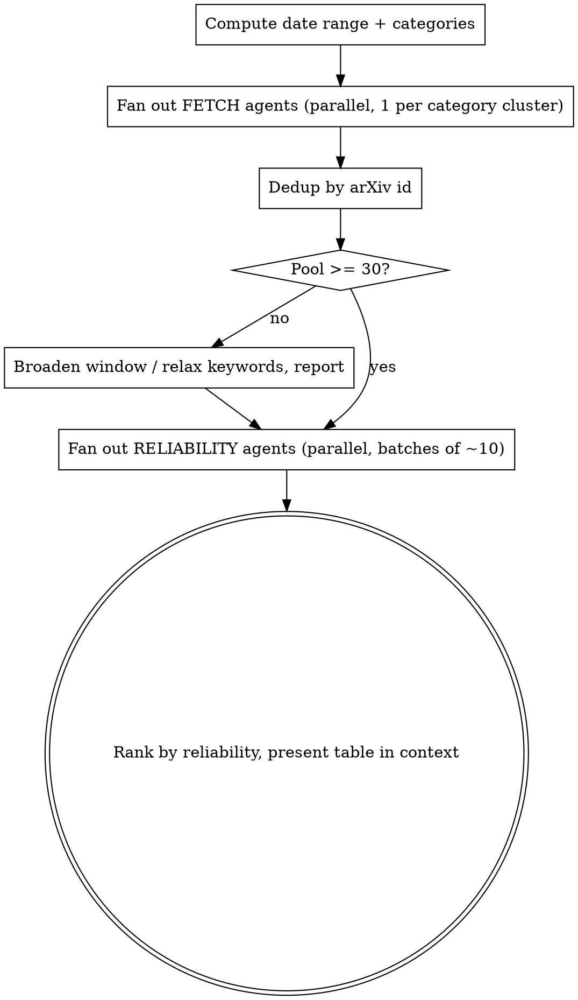

# Paper Radar

## Overview

Search-only paper discovery. Find recent papers across robotics / CV / CS, rate each
paper's **reliability**, and present a ranked candidate pool (≥30) for the user to pick from.

**Core principle: locate and rate, never summarize.** The user reads abstracts and picks
their own ~10. Output is a scannable table, not digests.

## When to Use

- "Find new robotics/CV papers from the last month"
- "Paper radar for diffusion policy / SLAM / VLA"
- User wants a pool to hand-pick from, not summaries

**When NOT to use:** if the user wants summaries/digests → use `daily-paper-generator` instead.

## Inputs (all optional)

| Arg | Default | Notes |
|-----|---------|-------|
| `topics` | robotics, CV, CS → `cs.RO, cs.CV, cs.AI, cs.LG` | Override with categories or themes |
| `keywords` | none | Free-text filter, e.g. "diffusion policy", "SLAM". OR-combined unless user says "all of" |
| `window` | last 30 days | Submission date range |
| `count` | ≥30 candidates | Minimum pool size before presenting |

## Workflow



1. **Compute** the date range (`date -d "30 days ago" +%Y%m%d`) and map topics → arXiv categories.
2. **Fetch (parallel sub-agents).** Dispatch one `Explore` or `general-purpose` agent per category
   cluster. Each builds the arXiv query, fetches, parses entries, returns structured rows. No judgment — just data.
3. **Dedup** by arXiv id (the same paper appears in `cs.RO` and `cs.CV`).
4. **Gate on count.** If pool < `count`, broaden the window or relax keywords and re-fetch.
   Never present fewer than 30 silently — say what was found.
5. **Reliability (parallel sub-agents).** Split the pool into batches of ~10. Each agent reads
   title + abstract + `comment` and assigns reliability + a one-line *why* (credibility rationale, NOT a paper summary).
6. **Rank** High → Medium → Low (tie-break by recency) and present the table.

## arXiv API Reference

Endpoint: `https://export.arxiv.org/api/query`

```bash
# URL-encode brackets: [ -> %5B, ] -> %5D, space -> +
FROM=$(date -d "30 days ago" +%Y%m%d)0000
TO=$(date +%Y%m%d)2359
curl -sS -m 30 \
  "https://export.arxiv.org/api/query?search_query=cat:cs.RO+AND+submittedDate:%5B${FROM}+TO+${TO}%5D&sortBy=submittedDate&sortOrder=descending&max_results=80" \
  -o out.xml
```

With keywords (title OR abstract):
`cat:cs.RO+AND+submittedDate:%5B...%5D+AND+%28abs:%22diffusion+policy%22+OR+ti:%22diffusion+policy%22%29`

Per `<entry>` parse: `<title>`, `<author><name>`, `<summary>` (abstract), `<published>`,
`<arxiv:comment>` (venue/page signal), `<id>` (the abs URL).

**Category map (default "robotics, CV, CS"):** `cs.RO` robotics, `cs.CV` vision,
`cs.AI` AI, `cs.LG` learning. Add `cs.SY`/`eess.SY` for control, `cs.CL` for language.

## Reliability Rubric

The user mostly sees unpublished preprints, so reliability = **where it's aimed** + **how sound it reads**.

| Tag | Criteria |
|-----|----------|
| **High** | `comment` states acceptance at a strong venue (CVPR, ICCV, ECCV, ICRA, IROS, RSS, CoRL, NeurIPS, ICML, ICLR, AAAI) **OR** clear contribution + real quantitative evaluation + code/dataset link |
| **Medium** | Solid method with some evaluation, arXiv-only, no acceptance or code stated |
| **Low** | Bold/vague claim, little or no evaluation shown, no venue or code signal |

The "why" column is one short phrase, e.g. `accepted IROS'26` / `strong eval + code` / `vague claim, no eval`.

## Output Format

Single ranked Markdown table shown in context, most-reliable first, ≥30 rows. No abstracts, no summaries.

| # | Title | Authors | Cat | Venue signal | Reliability | Why | Link |
|---|-------|---------|-----|--------------|-------------|-----|------|
| 1 | … | Smith et al. | cs.RO | IROS 2026 | High | peer-reviewed + code | arxiv.org/abs/… |

End with a one-line tally: `Found N, showing M` (flag any trimming — no silent truncation).

## Common Mistakes

- **Summarizing papers.** Don't. Only locate + rate. The "why" is a credibility note, not a digest.
- **Forgetting to URL-encode `[` `]`.** Use `%5B` / `%5D` or curl errors with "bad range".
- **Not deduping across categories.** Same arXiv id can match multiple `cat:` queries.
- **Silently showing < 30.** If the keyword/window is too narrow, say so and offer to broaden.
- **Fabricating rows when the API is empty/down.** Report the failure instead.
